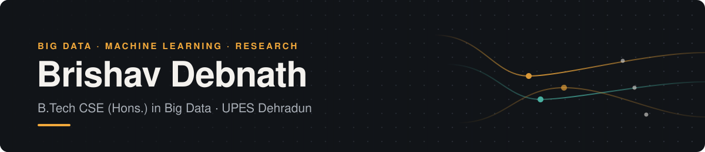

<!--
  Profile README for github.com/BrishavDebnath
  Repo: BrishavDebnath/BrishavDebnath (name must match the username exactly)
  Portfolio: docs/index.html → https://brishavdebnath.github.io/BrishavDebnath/
-->

<p align="center">
  <a href="https://brishavdebnath.github.io/BrishavDebnath/">
    
  </a>
</p>

<p align="center">
  <a href="https://brishavdebnath.github.io/BrishavDebnath/"></a>
  <a href="https://www.linkedin.com/in/brishav-debnath-b06148222"></a>
  <a href="mailto:brishavdevnath@gmail.com"></a>
  <a href="docs/Brishav_Debnath_Resume.pdf"></a>
</p>

---

### About

Final-year **B.Tech CSE (Hons.) in Big Data** student at **UPES Dehradun** (CGPA 9.12, graduating 2027).
My domain is **Big Data** and currently I am leaning more towards working on Data Science and Engineering for Machine Learning based applications.
Alongside coursework I have completed two **research internships**: AI for urban heat-island mitigation at **MNIT Jaipur** and fuzzy/statistical modelling of soil quality at **Tezpur University**.

```yaml
currently:   Final year, B.Tech CSE (Big Data) @ UPES
building:    Research Agent: a literature-review workspace for Obsidian (major project)
open_to:     Data / ML engineering roles, 2027 batch
```

---

### Selected projects

<table>
<tr>
<td width="50%" valign="top">

#### 🩺 Cancer Claim Verifier <sub>· repo coming soon</sub>
Retrieval-augmented misinformation detection. Labels a health claim **supported**, **contradicted** or **insufficient evidence**, and says so when no relevant source exists.

- BioBERT on 2,258 claim–evidence pairs
- **96.97%** accuracy · **0.967** macro-F1 on 198 held-out claims
- **94.11% ± 1.31%** over 30-fold CV
- Hybrid retrieval over ChromaDB · LIME explanations · 31 tests

`PyTorch` `Hugging Face` `ChromaDB` `LIME`

</td>
<td width="50%" valign="top">

#### 🛒 [Streaming Product Affinity Pipeline](https://github.com/BrishavDebnath/streaming-product-affinity) <sub>· [v1.0.0](https://github.com/BrishavDebnath/streaming-product-affinity/releases/tag/v1.0.0)</sub>
Finds products that shoppers view together in the same visit, as the clicks stream in. Kafka feeds Spark Structured Streaming, which writes to MongoDB, and FastAPI serves the results.

- Tested on 2.7M real RetailRocket events: **19.7%** hit-rate@10, **26.9x** a bestseller baseline
- **15,000 events/s** sustained on a laptop, and every event counted exactly once after a crash
- 128 tests, CI, CodeQL, and the whole stack starts with one `docker compose up`

`Kafka` `Spark` `MongoDB` `FastAPI` `Docker`

</td>
</tr>
<tr>
<td width="50%" valign="top">

#### 📚 Research Agent: Literature Review Workspace
Team major project. A literature-review workspace for Obsidian, built as a 5-package TypeScript monorepo. **My role: architecture and design documents.**

- Integrates React canvas, local server, Obsidian vault, OpenAlex and Semantic Scholar
- 53 MCP tools · 94 HTTP endpoints · token auth
- Activity log for AI-agent edits with conflict resolution
- Local LLM router via Ollama

`TypeScript` `MCP` `Obsidian` `Ollama`

</td>
<td width="50%" valign="top">

#### 💬 EmotiSense <sub>· repo coming soon</sub>
AI mood-tracking desktop app. A Java Swing front end calls a fine-tuned sentiment model and stores entries in SQLite.

- DistilBERT fine-tuned on Sentiment140: **84%** accuracy
- Pre-processing for slang, URLs, mentions, hashtags
- Java ↔ Python bridge; persistence over JDBC

`Java` `Python` `DistilBERT` `SQLite`

</td>
</tr>
</table>

---

### Research experience

| Where | What |
|---|---|
| **MNIT Jaipur**, Dept. of Management Studies<br><sub>Research Intern · May–Jul 2026</sub> | Reviewed 90+ peer-reviewed papers on AI for urban heat-island mitigation (remote sensing, PINNs, fuzzy control, deep RL). Built a six-capability gap matrix, designed a four-layer closed-loop architecture (GAN → PINN thermal model → 150-rule fuzzy safety layer → multi-agent Soft Actor-Critic), and wrote a 3-year DST proposal under the 2026 BRICS call. |
| **Tezpur University**, Dept. of Environmental Sciences<br><sub>Research Intern · Jun–Jul 2025</sub> | Used PCA to pick 5 low-correlation soil indicators from 23 features and built a 125-rule fuzzy inference model for soil-quality classes. Validated it with an RBF-SVM over 500 runs (accuracy 82.5% → 88.0%). Implemented Stochastic Frontier Analysis on 720 observations (mean technical efficiency 93.5%). |

---

### Toolbox

| | |
|---|---|
| **Languages** |     |
| **ML & NLP** |     |
| **Big Data** |   |
| **Data & Serving** |     |
| **Tools** |    |
| **Core CS** | OOP · Data Structures & Algorithms · DBMS |

---

<details>
<summary><b>Coursework & lab repositories</b></summary>
<br>

| Repository | Contents |
|---|---|
| [Python](https://github.com/BrishavDebnath/Python) | Python programming notebooks |
| [AI-ML_LAB](https://github.com/BrishavDebnath/AI-ML_LAB) | AI/ML lab exercises |
| [Algorithm_Lab_3rd_Sem-500127120-](https://github.com/BrishavDebnath/Algorithm_Lab_3rd_Sem-500127120-) | Design & Analysis of Algorithms lab (Sem 3) |
| [END-SEM-Final-Project-Submission](https://github.com/BrishavDebnath/END-SEM-Final-Project-Submission) | Animal Encyclopaedia, end-semester project |
| [Mid-Semester-Assignment](https://github.com/BrishavDebnath/Mid-Semester-Assignment) | Mid-semester project submission |

</details>

<p align="center"><sub>Open to data engineering and ML roles for the 2027 batch · <a href="mailto:brishavdevnath@gmail.com">brishavdevnath@gmail.com</a></sub></p>
